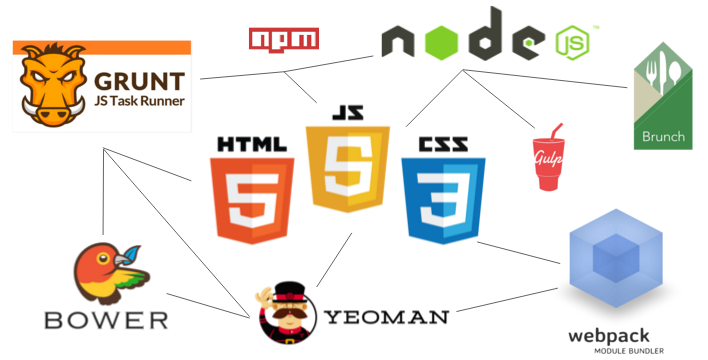
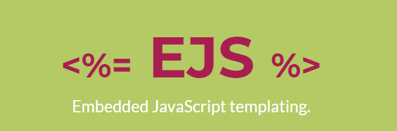

# A dive into developer tools

## Introduction
For the final project of the minor, its up to me to make a code setup with build tools.
We had a basic set up that involves Gulp but, Danny (our mentor) adviced us to start from scratch.
I always wanted to learn more about this subject, so I dove into the web and made a little research for what the project must have.

## Choosing a build tool
There is a huge list of build tools to choose from, but what do I choose?
I started my research by finding out what my project needs. It needed to do the following:

* Insert the data into the HMTL
* Compile the JS and CSS for faster performance
* Make strict code rules for our groep
* Something to make our lifes easier 

## Inert the data into the HTML
I started by going through the list. A quick and easy tool to insert data into HTML is "EJS".
It's something I have experience with because I use it for almost all of my projects. Its fast and easy to use.

## Compiling JS and CSS

## Strict code rules

## Making our lifes easier

## Conclusion

