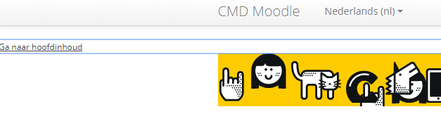
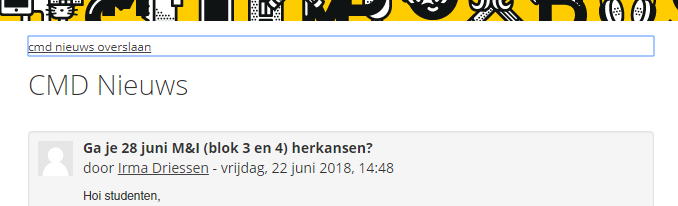
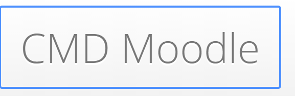
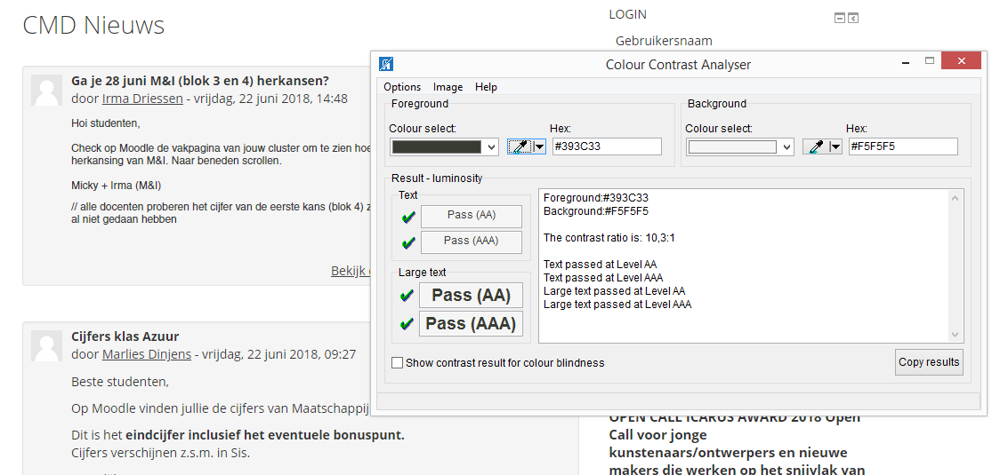
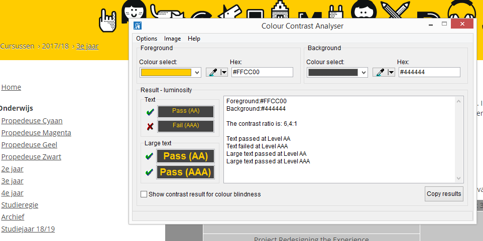
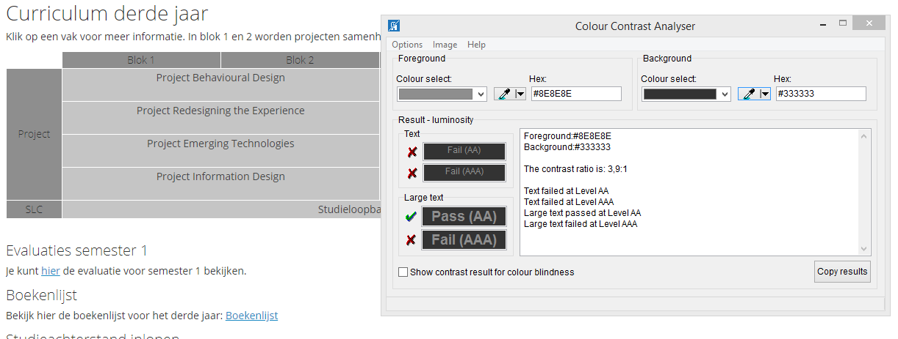

# Introduction
After I saw the talk of Ischa Gast at Schiphol talking about accessibility on the internet I got curious. 
In my minor that's linked with my education they always say that accessibility is really important and that you should always
design for it. I wonder, is the internal website from my education made accessible? Let's find out!

## Moodle Tab Navigation
Moodle is a platform where we can find our classes and homework. Let's start with a tab navigation.

woa! A skip to content button? That's great! 
that means that the user doesn't have to tab 100x to get to see where he/she came for.
Moodle is of to a good start. let's click the button and move on!

WHAT?! You can even skip more useless content!
This website has it all figured out.

## Moodle focus state
A focus state that gets the attention is something that can play out in your favour.
It can get attention and people will notice right away where they are.
Lets see how Moodle does it.

hmmm it seems they are using the default :focus state. 
I was expecting a litte more, but it still gets the job done.

## Moodle Colour Contrast
Seeing as the tab works perfectly, what aboutthe colour contrast? I have a usefull tool which can assist me with this called "Colour Contrast Analyzer". Let's start with the foreground and background contrast of the text en information displayed on the page.

Its perfect! 
nothing wrong here.

Auch! not as perfect as I hoped. 

This is just bad. The contrast is totally off.
