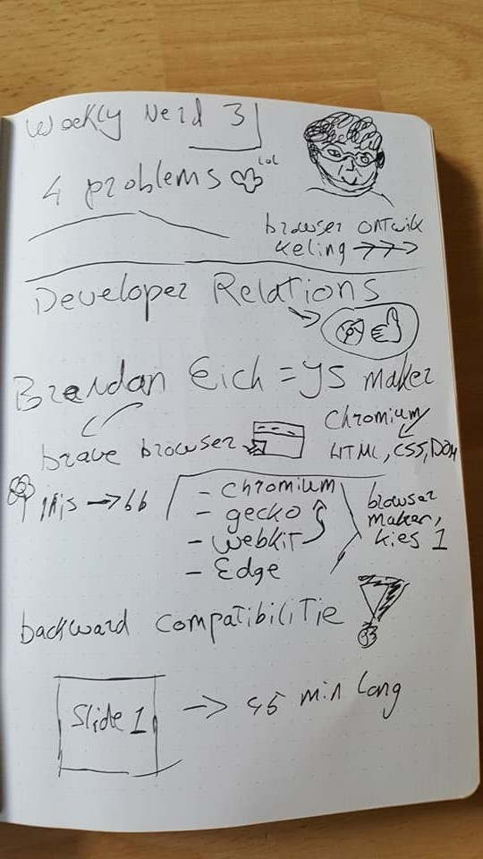

# Weekly Nerds Sketchnotes

## Week 1 | Brit Wijnmalen - Wednesday, Februari 9, 16:00 @ KSH
In the first week Brit Wijnmalen came by to talk about sketchnotes.

### subjects that came up in the talk
* What are sketchnotes?
* Why drawing is more effective than writing
* Sketchnote exercises
* Examples from Justus Sturkenboom

________________________________________________________________________________

## Week 2 | Titus Wormer - Wednesday, Februari 14, 16:00 @ KSH
In the second week Titus Wormer came by to talk about Git.

### subjects that came up in the talk
* What is the difference between git and github?
* What is licensing? and when do you use what?
* What is open source? and the future of open source
* The timeline of the web

________________________________________________________________________________

## Week 3 | Peter Paul Koch - Tuesday, Februari 20, 16:00 @ KSH
In the third week Peter Paul Koch came by to talk about web Browsers.

### subjects that came up in the talk
* Developer relations
* What browser do you need to choose?
* the 4 problems

________________________________________________________________________________

## Week 4 | Anne van den Hoogen - Tuesday, March 14, 16:00 @ Tamtam
In the fourth week we went to Anne van den Hoogen at Tamtam, she talked about the company she workes at.

### subjects that came up in the talk
* What is Dept agency?
* Talking about the Walibi website they made
* Code structure inside their company
* The flow of how a developers week looks like

________________________________________________________________________________

## Week 5 | Jasper Moelker - Wednesday, March 21, 16:00 @ Voorhoede
In the fifth week we went to Jasper Moelker at the Voorhoede, he talked about progressive enhancement.

### subjects that came up in the talk
* What is Progressive enhancement?
* Code components
* Pattern primer
* Exercises

________________________________________________________________________________

## Week 6 | Ischa Gast - Wednesday, March 28, 16:00 @ Schiphol
In the sixth week we went to Ischa Gast at Schiphol, he talked about accessibility on the web.

### subjects that came up in the talk
* Why is accessibility important?
* Tools to make sure you are designing for everyone
* How does a blind person use a screenreader?

________________________________________________________________________________

## Week 7 | Niels Leenheer - Wednesday, April 11, 16:00 @ KSH
In the seventh week Niels Leenheer came by to talk about obscure browsers.

### subjects that came up in the talk
* Bluetooth on the web
* His own made iot devices

________________________________________________________________________________

## Week 8 | Peter Peerdeman - Wednesday, April 18, 16:00 @ Lively
This one was cancelled :(

________________________________________________________________________________

## Week 9 | Léonie Watson - Wednesday, April 25, 16:00 @ KSH
This one was cancelled :(

________________________________________________________________________________

## Week 10 | Hackaton - Friday, May 25, 11:00 @ KSH
I missed this one, because I was busy with my resit for multiple courses.

________________________________________________________________________________

## Week 11 | Vitaly Friedman - Wednesday, June 6, 16:00 @ TTH
In the eleventh week Niels Vitaly Friedman came by to talk about making the web fun.

### subjects that came up in the talk
* Make boring design fun
* Fun examples on the internet
* What is good design?

________________________________________________________________________________

## Week 12 | Bruce Lawson - Wednesday, June 20, 13:00 @ KSH
In the eleventh week Niels Vitaly Friedman came by to talk about making the web fun.

### subjects that came up in the talk
* Sausages
* Patents is a forbidden word
* CSS colour names

